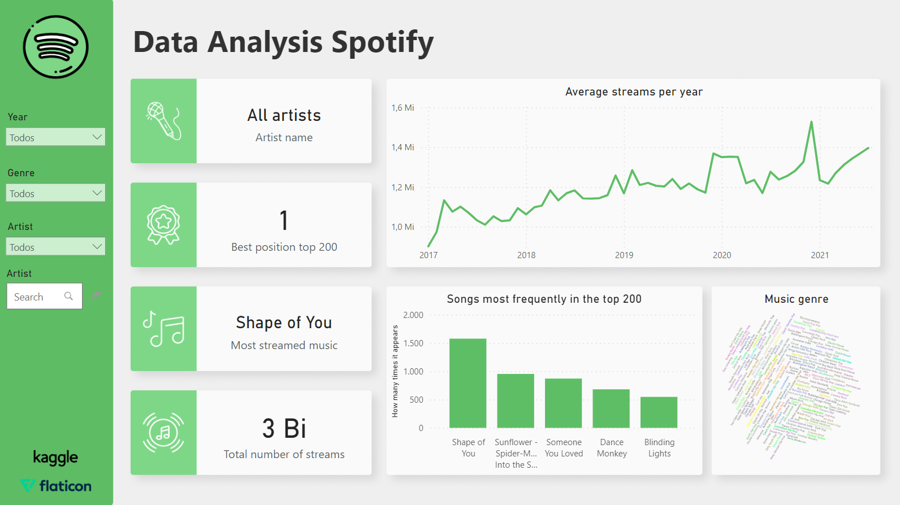

# Data analysis - Spotify

This repository aims to put into practice the knowledge obtained in Power BI training on the [Alura](https://www.alura.com.br/) platform. In this way, a [Kaggle](https://www.kaggle.com/) database was used with data referring to the top 200 on spotify between the years 2017 and 2021 to create a dashboard with several metrics referring to these songs and artists. Also, icons made by [Flaticon](https://www.flaticon.com/s) were used to create the dashboard.

The link with the dataset can be found [here](https://www.kaggle.com/datasets/ivannatarov/spotify-daily-top-200-songs-with-genres-20172021) or you can download the file `data.csv` in this repository.

The link with the complete dashboard can be found [here](https://app.powerbi.com/view?r=eyJrIjoiZmY5YjA4YjUtODg4MC00MGIxLWJjZTEtMmVkZTg5ODhlYjg4IiwidCI6ImRjYmYyYTFmLTk1MzItNGQ1Ni1hYzQxLTU2MTVlMzhlNTBiNyJ9)

## About the database

After correctly separating the data, which are delimited with the # character, 6 columns are obtained with the following data:

Position   | Track Name                             |Artist           |Streams|Date      |Genre
---------  | ---------------------------------------|-----------------|-------|----------|--------
1          | Starboy                                |The Weeknd       |3135625|2017-01-01|['canadian pop', 'canadian contemporary r&b', 'pop']
2          | Closer                                 |The Chainsmokers |3015525|2017-01-01|['pop', 'pop dance', 'tropical house', 'edm', 'electropop', 'dance pop']
3          | Let me love you                        |DJ Snake         |2545384|2017-01-01|['pop', 'electronic trap', 'dance pop', 'edm', 'pop dance', 'pop rap']
4          | Rockabye (feat. Sean Paul & Anne-Marie |Clean Bandit     |3256604|2017-01-01|['pop', 'uk dance', 'dance pop', 'uk funky', 'tropical house', 'pop dance', 'post-teen pop', 'edm']

After that, the database was treated by separating the musical genres into a new table, with the respective name of each artist, and creating a many-to-many relationship between these tables.

## The dashboard

This was the end result with the data analysis dashboard on spotify. It has 3 filters, according to the year, musical genre and artist name (both as a multiple choice option and textual search), and data can be viewed referring to the 5 most played songs (according to filters), musical genres of a certain artist, average streams according to each period of the year.

Also in the form of cards, individual artist information can be seen, such as the best position obtained in the top 200, the number of streams of songs by that artist, and his most listened to song.

